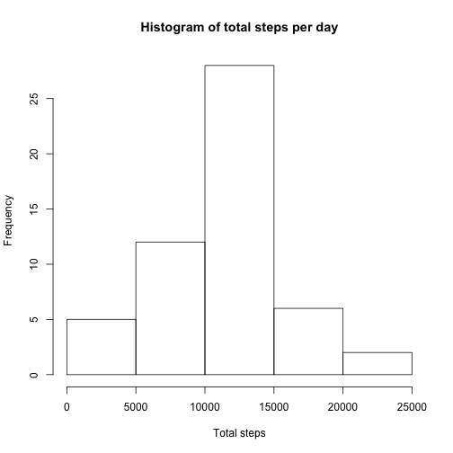

Reproducible Research: Peer Assessment 1 
=====================
This is the report answering the questions of the Peer Assignment 1 for the Reproducible Research course.


## Loading and preprocessing the data
First of all, the activity data needs to be loaded in R. Since it is a zip file, we combine the `read.csv` and `unzip` functions to achieve it.


```r
data <- read.csv(unzip("activity.zip"))
```

We check that the data has been successfully loaded with `head` function, as well as the format of the `data.fame`.

```r
head(data)
```

```
##   steps       date interval
## 1    NA 2012-10-01        0
## 2    NA 2012-10-01        5
## 3    NA 2012-10-01       10
## 4    NA 2012-10-01       15
## 5    NA 2012-10-01       20
## 6    NA 2012-10-01       25
```

As explained in the information provided, the data includes three variables  (steps, date and interval), and they have the expected format.


## What is mean total number of steps taken per day?
To reply to this question, firstly we calculate the sum of the steps of each interval for every day.

```r
totalSteps <- aggregate(list(Total=data$steps), by=list(Date=data$date), sum)
```
This generates a data frame with the following dimensions:

```r
dim(totalSteps)
```

```
## [1] 61  2
```
And two variables: Date and Total (referred to total steps).

```r
head(totalSteps)
```

```
##         Date Total
## 1 2012-10-01    NA
## 2 2012-10-02   126
## 3 2012-10-03 11352
## 4 2012-10-04 12116
## 5 2012-10-05 13294
## 6 2012-10-06 15420
```
Then, we plot a histogram of the total number of steps taken each day, as follows:

```r
hist(totalSteps$Total, main="Histogram of total steps per day", xlab="Total steps")
```

 


From this set of total step values, we calculate the mean and median values, respectively:

```r
mean(totalSteps$Total, na.rm=TRUE)
```

```
## [1] 10766.19
```

```r
median(totalSteps$Total, na.rm=TRUE)
```

```
## [1] 10765
```


## What is the average daily activity pattern?
To calculate the average daily activity pattern, first of all we calculate the average number of steps taken, averaged across all days, for each interval considered:

```r
meanInterv <- aggregate(list(Mean=na.omit(data)$steps), by=list(Interval=na.omit(data)$interval), mean)
```
This generates a data frame with the following dimensions:

```r
dim(meanInterv)
```

```
## [1] 288   2
```
And two variables: Interval and Mean.

```r
head(meanInterv)
```

```
##   Interval      Mean
## 1        0 1.7169811
## 2        5 0.3396226
## 3       10 0.1320755
## 4       15 0.1509434
## 5       20 0.0754717
## 6       25 2.0943396
```
Now we are able to make a time series plot of the 5-minute interval (x-axis) and the average number of steps taken, averaged across all days (y-axis):

```r
plot(meanInterv$Interval, meanInterv$Mean, type="l", xlab="5-min interval", ylab="Average # steps", main="Time series plot")
```

 

And we can see which is the 5-minute interval, on average across all the days in the dataset, that contains the maximum number of steps with this line of code:

```r
meanInterv[which.max(meanInterv$Mean), 1]
```

```
## [1] 835
```


## Imputing missing values
We calculated the total number of missing values in the dataset (i.e. the total number of rows with NAs) with the following line of code:

```r
sum(!complete.cases(data))
```

```
## [1] 2304
```
The result is 2304 rows with NAs in our dataset.

In order to fill in all of the missing values in the dataset, we decided to use the mean for that same 5-minute interval. We created a copy of the original dataset, named `newData`, and were able to replace the `NA` values in it with this piece of code:

```r
# create copy of the data set
newData <- data
# for loop that checks the positions of the NA values and replaces them with the appropriate interval mean value
for (i in which(is.na(newData$steps))){
   newData[i,1] <- meanInterv$Mean[meanInterv$Interval==newData[i,3]]
}
# we check that the replacement has worked
head(data)
```

```
##   steps       date interval
## 1    NA 2012-10-01        0
## 2    NA 2012-10-01        5
## 3    NA 2012-10-01       10
## 4    NA 2012-10-01       15
## 5    NA 2012-10-01       20
## 6    NA 2012-10-01       25
```

```r
head(newData)
```

```
##       steps       date interval
## 1 1.7169811 2012-10-01        0
## 2 0.3396226 2012-10-01        5
## 3 0.1320755 2012-10-01       10
## 4 0.1509434 2012-10-01       15
## 5 0.0754717 2012-10-01       20
## 6 2.0943396 2012-10-01       25
```

Now we can calculate a new total of steps value per day and plot a new histogram:

```r
newTotal <- aggregate(list(Total=newData$steps), by=list(Date=newData$date), sum)
hist(newTotal$Total, main="Histogram of total steps per day", xlab="Total steps")
```

 

The new values of mean and median for the dataset with replaced `NA` are:

```r
mean(newTotal$Total, na.rm=TRUE)
```

```
## [1] 10766.19
```

```r
median(newTotal$Total, na.rm=TRUE)
```

```
## [1] 10766.19
```
Given our strategy (imputing the mean of the interval), the estimated mean does not change from from the first part of the assignment. This, however, has an impact on the median, which adopts the same value as the mean.

## Are there differences in activity patterns between weekdays and weekends?
To answer this, first we use the `weekdays()` function to translate the `date` variable to name of the weekday. For this, we use the dataset with the filled-in missing values.

```r
# create new variable with weekday names
newData$DayName <- weekdays(as.Date(newData$date))
# create day groups: weekend or weekday
weekday <- c("Monday", "Tuesday", "Wednesday", "Thursday", "Friday")
weekend <- c("Saturday", "Sunday")
# replace with day groups
newData$DayName[newData$DayName %in% weekday] <- "weekday"
newData$DayName[newData$DayName %in% weekend] <- "weekend"
# change class to 'factor'
newData$DayName <- as.factor(newData$DayName)
```
A new variable (factor) named `DayName` has been created in the dataframe with two levels – “weekday” and “weekend” indicating whether a given date is a weekday or weekend day.

Finally, we make a panel plot containing a time series plot of the 5-minute interval (x-axis) and the average number of steps taken, averaged across all weekday days or weekend days (y-axis). 
To be able to plot this, we first calculate the averages for weekday and weekend separately and then bind them in the same dataframe for plotting purposes:

```r
# average on weekday group
intervDay <- aggregate(list(Steps=na.omit(newData)[newData$DayName=="weekday",1]), by=list(Interval=na.omit(newData)[newData$DayName=="weekday",3]), mean)
# average on weekend group
intervEnd <- aggregate(list(Steps=na.omit(newData)[newData$DayName=="weekend",1]), by=list(Interval=na.omit(newData)[newData$DayName=="weekend",3]), mean)
# introduction of factor for combination purposes
intervDay$DayName <- as.factor(rep("weekday", nrow(intervDay)))
intervEnd$DayName <- as.factor(rep("weekend", nrow(intervEnd)))
# combination of both dfs
avgInterv <- rbind(intervDay, intervEnd) 
# load lattice
library(lattice)
# plot time series
xyplot(Steps~Interval | DayName, data=avgInterv, pch=19, layout=c(1,2), type="l")
```

 
